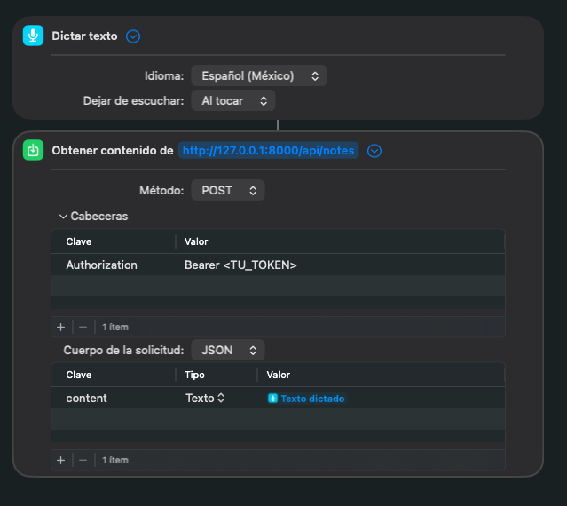

<p align="center"><a href="https://laravel.com" target="_blank"></a></p>

<p align="center">
<a href="https://github.com/laravel/framework/actions"></a>
<a href="https://packagist.org/packages/laravel/framework"></a>
<a href="https://packagist.org/packages/laravel/framework"></a>
<a href="https://packagist.org/packages/laravel/framework"></a>
</p>

# 📝 App de Notas (con Servidor MCP)

Esta es una aplicación Laravel 11 con Jetstream (Livewire) que funciona como un sistema personal de notas. Integra un servidor **Model Context Protocol (MCP)**, permitiendo que agentes de IA interactúen con las notas del usuario de forma segura a través de una API.

## 🏗 Arquitectura

El sistema de notas está dividido en dos conceptos distintos para mantener los datos organizados:

### 1. Notas de Línea de Tiempo (`Note` model)
Notas estándar que representan entradas cronológicas, como un diario o un registro secuencial.
- **Campos:** `title` (opcional), `content`, `created_at`.
- **Búsqueda:** Basada en la fecha de creación (`created_at`).
- **Herramientas MCP:**
  - `create-note`: Crea una nueva nota en la línea de tiempo.
  - `edit-note`: Edita una nota usando su `id` numérico.
  - `get-recent-notes`: Devuelve las notas de los últimos X días.
  - `get-month-notes`: Devuelve las notas creadas en un mes específico.
  - `get-all-tags`: Devuelve la lista de todas las etiquetas únicas del usuario.
- **Recursos MCP:**
  - `timeline://recent/{days}`: Acceso dinámico a las notas más recientes.

### 2. Notas con Clave (`KeyNote` model)
Notas especializadas identificadas por un "key" (clave) de texto único. Útiles para guardar preferencias, memoria del asistente o configuraciones.
- **Campos:** `key` (único por usuario), `title` (opcional), `content`, `created_at`.
- **Búsqueda:** Basada en el texto `key` o por fecha de creación reciente.
- **Herramientas MCP:**
  - `create-key-note`: Crea una nueva nota con un `key` específico.
  - `edit-key-note`: Edita una nota existente referenciando su `key`.
  - `get-memory`: Herramienta de acceso directo para obtener la nota con el key `'memory'`.
  - `get-last-key-notes`: Recupera las últimas X notas con clave creadas.
- **Recursos MCP:**
  - `memory://core`: Acceso directo a la nota de memoria del usuario.
  - `tags://all`: Lista global de etiquetas para categorización.

### 3. Flujos de Trabajo (Prompts)
El servidor ahora incluye plantillas de prompts para guiar a la IA en tareas complejas:
- **`Summarize Timeline`**: Instruye a la IA para que lea las notas recientes de la línea de tiempo y actualice la memoria estructurada del usuario.


## 🔐 Autenticación

El Servidor MCP es accesible mediante un endpoint HTTP (`/api/mcp/notes`) y está protegido usando **Laravel Sanctum**.

Los agentes que se conecten a este servidor deben proporcionar un token Bearer en el header de Authorization:
```bash
Authorization: Bearer <tu_token_sanctum>
```
Este token identifica automáticamente al usuario, garantizando que todas las notas creadas y los datos recuperados pertenezcan estrictamente al usuario autenticado.

## Documentación y Notas Técnicas

Para decisiones de arquitectura, peculiaridades de Livewire 3 y resolución de problemas comunes (como el manejo de eventos en slots o modales), consulta la carpeta `docs/`:
- [Notas Técnicas y Troubleshooting](docs/technical-notes.es.md)

## 🚀 Empezando

1. Clona el repositorio e instala las dependencias:
   ```bash
   composer install
   npm install
   ```

2. Configura tu archivo de entorno:
   ```bash
   cp .env.example .env
   php artisan key:generate
   ```

3. Ejecuta las migraciones y siembra la base de datos:
   - **Para desarrollo (con notas de prueba generadas aleatoriamente):**
     ```bash
     php artisan migrate:fresh --seed
     ```
   - **Para producción (solo crea el usuario Admin y la nota clave `memory` en blanco):**
     ```bash
     php artisan migrate --force
     php artisan db:seed --class=ProductionSeeder --force
     ```

4. Genera un token MCP para el usuario sembrado (notas@example.com, o tu ADMIN_EMAIL configurado en .env) para usarlo con tu agente de IA:
   ```bash
   php artisan tinker --execute="echo App\Models\User::where('email', env('ADMIN_EMAIL', 'notas@example.com'))->first()->createToken('mcp')->plainTextToken;"
   ```

5. Inicia la aplicación:
   ```bash
   php artisan serve
   ```

## 🤖 Conectando Clientes de IA

### En Cursor IDE
Cursor tiene soporte nativo para conectarse a servidores MCP basados en web (SSE/HTTP).
1. Abre Cursor Settings > **Features** > **MCP**.
2. Haz clic en **+ Add New MCP Server**.
3. Selecciona **SSE** (o Web) como el tipo.
4. Establece Name: `Notes`
5. Establece URL: `http://127.0.0.1:8000/api/mcp/notes`
6. Agrega el Header: `Authorization` con el valor `Bearer <tu_token>`.

### En Claude Desktop / Otras Configuraciones JSON
Si tu cliente de IA utiliza un archivo de configuración (como `claude_desktop_config.json`) y admite endpoints remotos o si estás utilizando un puente proxy de SSE a STDIO, la configuración se verá similar a esta:

```json
{
  "mcpServers": {
    "laravel-notes": {
      "command": "npx",
      "args": [
        "-y",
        "supergateway",
        "--streamableHttp",
        "http://127.0.0.1:8000/api/mcp/notes",
        "--header",
        "Authorization: Bearer <tu_token>"
      ]
    }
  }
}
```
*(Nota: Dado que esta es una API HTTP protegida por Sanctum, generalmente se requiere usar un adaptador proxy como `supergateway` para los clientes de escritorio que solo admiten la ejecución de comandos locales).*

## 🛠 Pruebas y Depuración (Testing)

### Tests Unitarios
Las herramientas, recursos y prompts MCP tienen tests PHPUnit automatizados. Ejecútalos con:
```bash
php artisan test tests/Feature/Mcp/
```

El test suite usa `RefreshDatabase` y los helpers de testing de Laravel MCP via llamadas estáticas en la clase del servidor:
```php
NotesServer::actingAs($user)->resource(MemoryResource::class)->assertOk();
NotesServer::actingAs($user)->prompt(SummarizeTimelinePrompt::class, ['days' => '7'])->assertSee('memory');
```

### Inspector Interactivo
Para probar las herramientas, recursos y prompts del servidor MCP de forma interactiva:

#### 1. Inicia el servidor de Laravel
```bash
php artisan serve
```

#### 2. Genera un Token de acceso
Como el servidor está protegido por Sanctum, necesitas un token Bearer:
```bash
php artisan tinker --execute="echo App\Models\User::first()->createToken('mcp-test')->plainTextToken;"
```

#### 3. Usa el Inspector MCP
Tienes dos formas de abrir el inspector:

**Opción A: Inspector integrado (Recomendado)**
```bash
# El 'handle' suele ser la última parte de la ruta (en este caso 'notes')
php artisan mcp:inspector notes
```

**Opción B: Inspector oficial (npx)**
```bash
npx @modelcontextprotocol/inspector http://127.0.0.1:8000/api/mcp/notes
```

*Nota: Una vez abierto el inspector, asegúrate de añadir el header `Authorization` con el valor `Bearer <tu_token>` en la configuración de la conexión.*


## 🎙️ Integración con Atajos de Mac (Grabar Notas de Voz)

Puedes integrar fácilmente el endpoint `POST /api/notes` con la aplicación Atajos (Shortcuts) de macOS/iOS para crear un atajo llamado "Grabar Nota". Esto te permite dictar una nota y enviarla directamente a tu aplicación en segundo plano.

> **Importante:** Para que este atajo funcione, debes generar un Token API desde la vista de tu perfil en la aplicación web (sección **API Tokens**) y asegurarte de marcar la casilla del permiso **`create`** (permisos de escritura).

### Cómo crear el Atajo paso a paso:
1. Abre la aplicación **Atajos** (Shortcuts) en tu Mac o iPhone y crea uno nuevo.
2. Añade la acción **Dictar texto** (esto capturará tu voz y la convertirá a texto).
3. Añade la acción **Obtener contenido de la URL**.
   - **URL**: `http://127.0.0.1:8000/api/notes` (o tu dominio en producción).
   - Haz clic en la flecha para "Mostrar más".
   - **Método**: `POST`
   - **Cabeceras (Headers)**:
     - `Authorization`: `Bearer <TU_TOKEN>` *(Asegúrate de que el token generado en Jetstream tenga el permiso `create`)*.
     - `Accept`: `application/json`
   - **Cuerpo de la solicitud (Request Body)**: Selecciona `JSON`
     - Añade un nuevo campo: `content` (Texto) -> asigna como valor la variable `Texto dictado` del paso 2.

¡Listo! Ahora puedes usar el atajo desde el menú de tu Mac, con Siri, o con un atajo de teclado. Al hablar, tu nota se guardará automáticamente en el sistema y, como no envías un título, se le asignará la fecha actual por defecto.


